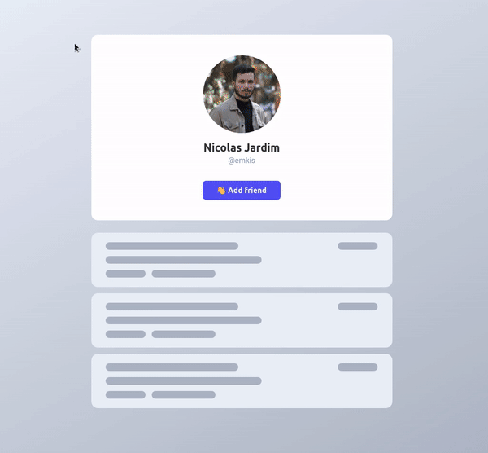

<h1 align="center">
  
</h1>

### :calendar: Where will happen?
**@UOL EdTech**, Nov 2020

### :paperclip: Presentation resources
All the resources used in the presentation are available in the **resources** folder and all the code I build is in **code** folder.

### :eyes: Project preview
You can access the **[live project here](https://vigorous-hugle-eae992.netlify.app)**.

Below is a quick example of what I will show in this presentation to prove my point.

### :crocodile: Project diagram
Simple diagram representing how the app is built.

