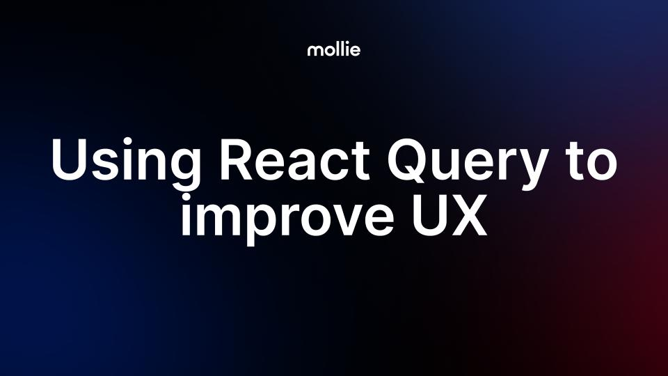

<h1 align="center">
  
</h1>

### :calendar: Where did it happen?
[**ReactJS Lisbon**](https://www.meetup.com/reactjs-lisbon), Feb 2023

### :paperclip: Presentation resources
All resources used for the presentation are available in the **resources** folder and all the code is in **code** folder.

### :eyes: Project preview
You can access the **[live project here](https://emkis-react-query-talk.netlify.app)**.
