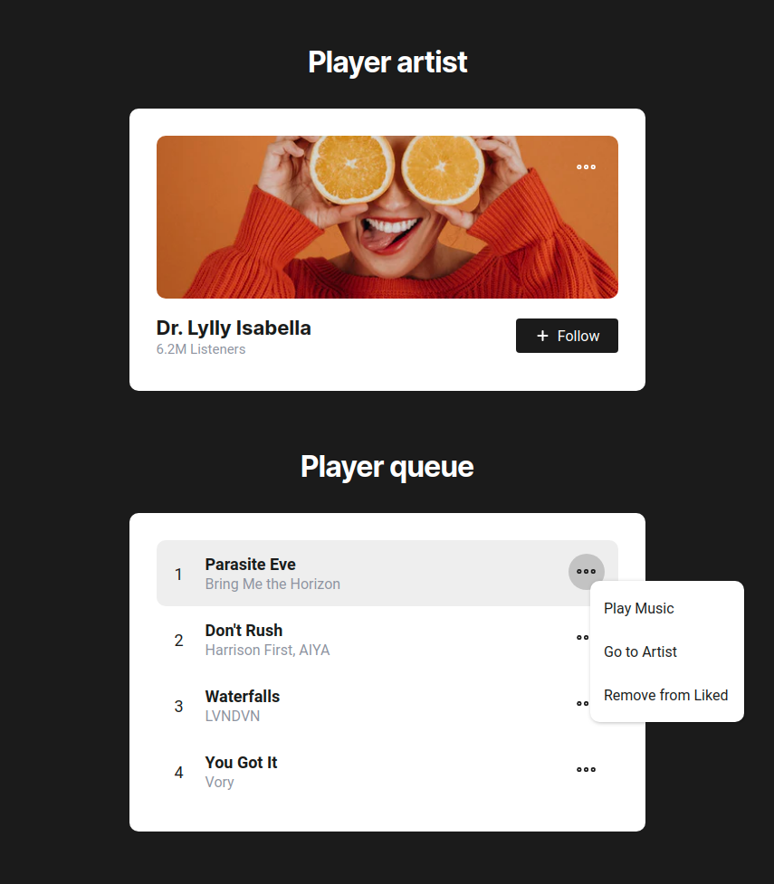

<h1 align="center">
  
</h1>

### :calendar: Where did it happen?
**@UOL EdTech**, Jul 2020

### :cinema: [Video](https://youtu.be/gy_JZaXBykM)
Watch this [talk on YouTube](https://youtu.be/gy_JZaXBykM)

### :paperclip: Presentation resources
All the resources used in the presentation are available in the **resources** folder and all the code I build is in **code** folder.

### :eyes: Project preview
Just a quick look on what i gonna show in this talk.

